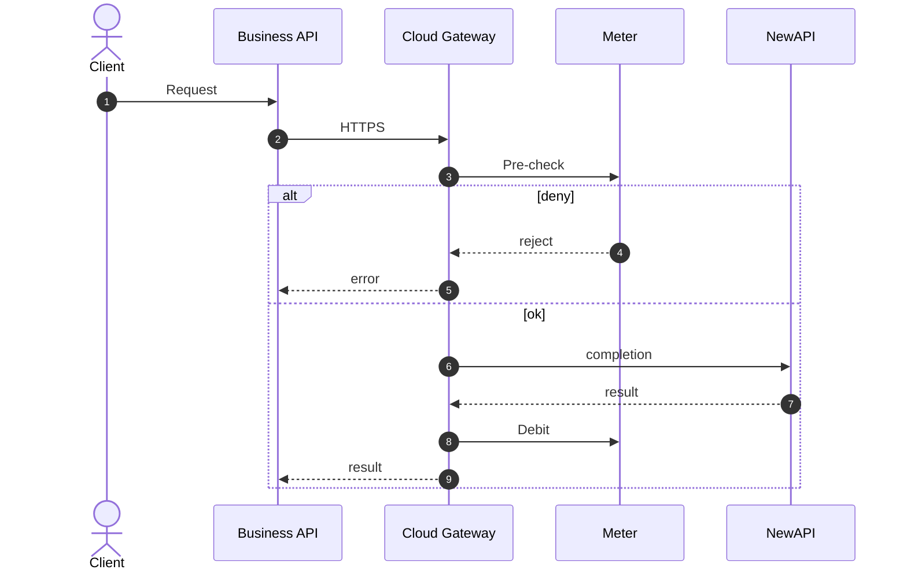
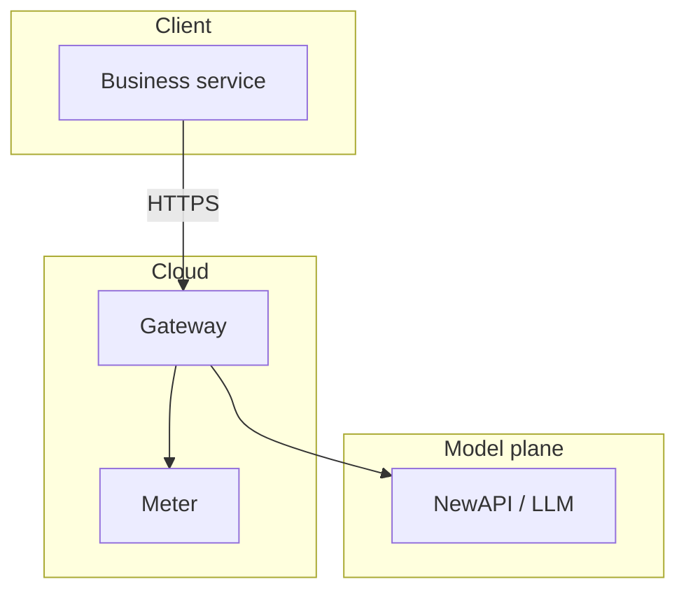

# Professional Mermaid (Pi Deck product)

Pi Deck also injects a mandatory diagram-quality append system prompt on every parent session. This skill expands templates when you need a full diagram.

## Hard bans

- Toy 2–4 node chains without branches or real names
- Nested `→` trees / ASCII boxes pretending to be architecture
- Diagrams weaker than the surrounding prose

## Prefer

| Need | Chart |
|------|--------|
| Call order | `sequenceDiagram` + `alt`/`opt` |
| Topology | `flowchart TB` + `subgraph` zones |
| State | `stateDiagram-v2` |
| Data | `erDiagram` |

## Sequence template

## Topology template

Close every fence. Optional last line: `%% mermaid-hash: <8 hex>`.
